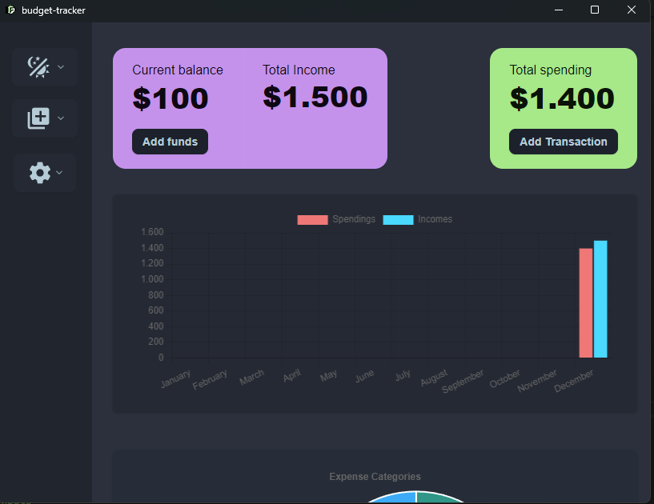
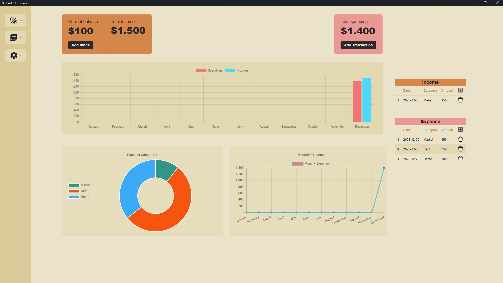
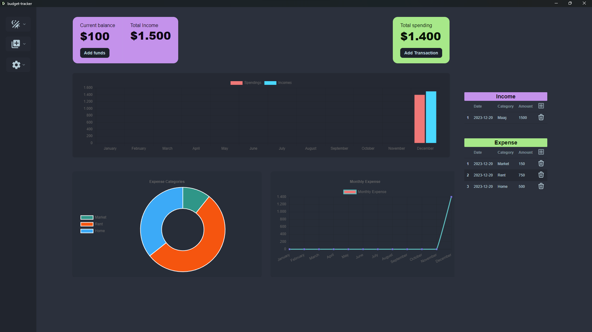
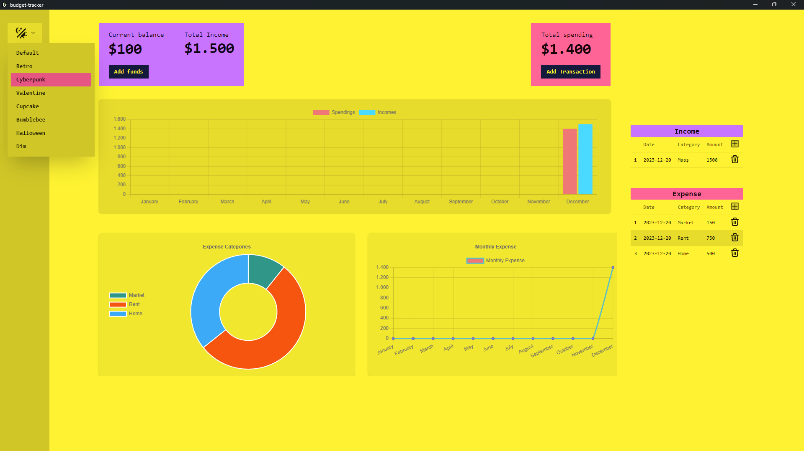

# Budget Tracker App

## Table of Contents

1. Overview
2. Features
3. Installation
4. Usage
5. Support & Contribution

## Overview

Budget Tracker is a lightweight, fast, and user-friendly application to manage your finances. Built with Tauri, Vue.js, and ts-tauri-plugin-store, it offers a seamless experience for tracking income and expenses. With an installation size of just 6MB, it's lightweight and operates offline.



## Features

- **Tauri + Vue.js Integration:** A powerful combination ensuring a responsive UI and robust performance.
- **ts-tauri-plugin-store:** Enables efficient data storage and retrieval.
- **Offline Operation:** Manage your budget anytime, anywhere without the need for an internet connection.
- **Theme Options:** Customize the look of your app with various theme options to suit your aesthetic preferences.

## Installation

1. Clone the repository:

   ```sh
   git clone https://github.com/mahmutessiz/budget-tracker-desktop.git

   ```

2. Navigate to the project directory:

```sh
   cd budget-tracker
```

3. Install dependencies:

```sh
   npm install
```

4. Build the app:

```sh
   npm run build
```

# Or download the app directly

Download the latest release here: https://github.com/mahmutessiz/budget-tracker-desktop/releases.

## Usage

Launch the app and start managing your budget immediately! Add income sources and expenses to track your financial health in real-time.

## Adding Transactions

Click on “Add Transaction” to input new income or expense items.



## Viewing Statistics

Explore graphical representations of your financial data through various charts available on the dashboard.



## Themes



Support & Contribution
Feel free to fork this project, contribute or suggest any features via issues.

Happy Budgeting!

## Recommended IDE Setup

- [VS Code](https://code.visualstudio.com/) + [Volar](https://marketplace.visualstudio.com/items?itemName=Vue.volar) + [Tauri](https://marketplace.visualstudio.com/items?itemName=tauri-apps.tauri-vscode) + [rust-analyzer](https://marketplace.visualstudio.com/items?itemName=rust-lang.rust-analyzer)

## Type Support For `.vue` Imports in TS

Since TypeScript cannot handle type information for `.vue` imports, they are shimmed to be a generic Vue component type by default. In most cases this is fine if you don't really care about component prop types outside of templates. However, if you wish to get actual prop types in `.vue` imports (for example to get props validation when using manual `h(...)` calls), you can enable Volar's Take Over mode by following these steps:

1. Run `Extensions: Show Built-in Extensions` from VS Code's command palette, look for `TypeScript and JavaScript Language Features`, then right click and select `Disable (Workspace)`. By default, Take Over mode will enable itself if the default TypeScript extension is disabled.
2. Reload the VS Code window by running `Developer: Reload Window` from the command palette.

You can learn more about Take Over mode [here](https://github.com/johnsoncodehk/volar/discussions/471).
